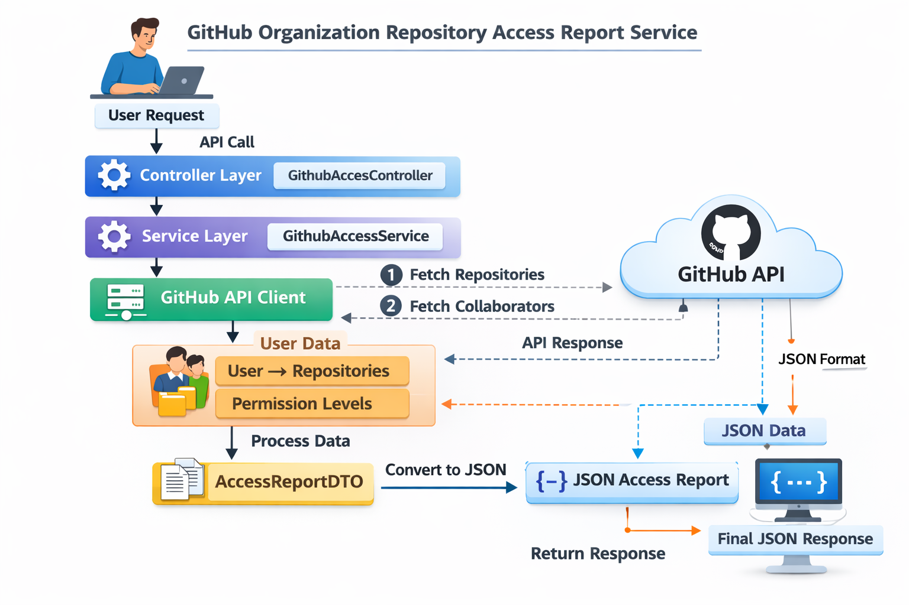
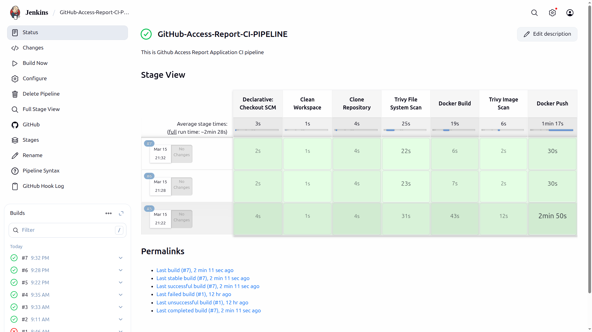

<div align="center">

# 🚀 GitHub Access Report Service


<p>
A backend service that analyzes repository collaborators and generates structured access reports for GitHub organizations.
</p>

</div>

---

## 📘 Overview

Organizations often need visibility into **which users have access to which repositories** within a GitHub organization. This project provides a backend service that connects to the GitHub API, retrieves repository and collaborator information, and generates a structured access report.

The service aggregates repository access data and exposes it through a REST API endpoint. This enables administrators or internal tools to quickly analyze repository access across an organization.

The application is built using **Spring Boot** and follows clean backend architecture principles to ensure maintainability, scalability, and reliability.

<br>

<p align="center">
  
</p>

---

## 🎥 Project Demonstration

This short video demonstrates:

- Application workflow
- API usage
- Example responses

Click the thumbnail below to watch the demo.

[](https://youtu.be/1KEM7v2T0eI)

---

## 🧠 Problem Statement

The system solves the following organizational challenges:

| Capability               | Description                                              |
| ------------------------ | -------------------------------------------------------- |
| 🔐 Secure Authentication | Secure authentication using GitHub Personal Access Token |
| 📦 Repository Discovery  | Fetch all repositories in an organization                |
| 👥 Collaborator Access   | Retrieve collaborator access for each repository         |
| 📊 Access Aggregation    | Aggregate users with repositories they can access        |
| 🌐 API Exposure          | REST API to generate access reports                      |
| 🛡 Permission Handling   | Handles GitHub API permission restrictions               |
| ⚙️ Error Handling        | Graceful error handling                                  |

---

## ✨ Key Features

* 🔐 Secure authentication using GitHub Personal Access Token
* 🔗 Connects securely to the **GitHub REST API**
* 📂 Retrieves repositories belonging to a GitHub organization
* 👥 Determines which users have access to each repository
* 📊 Generates an aggregated **user → repositories access report**
* 🌐 Exposes the report through a **REST API endpoint**
* 🛡 Handles GitHub API permission restrictions
* ⚙️ Graceful error handling
* 🚀 Supports organizations with **100+ repositories and 1000+ users**

---

## 🏗 Production-Ready Enhancements

Beyond the minimum requirements, this project includes several improvements typically used in real-world backend systems:

| Enhancement                      | Purpose                                                             |
| -------------------------------- | ------------------------------------------------------------------- |
| 📑 Pagination Support            | Handles large organizations by retrieving repositories page-by-page |
| ⚡ Parallel API Calls             | Improves performance when fetching collaborator data                |
| 🔁 Retry Mechanism               | Retries requests during temporary API failures                      |
| ⏱ Timeout Configuration          | Prevents long waiting times for external API calls                  |
| 📉 Rate Limit Awareness          | Handles GitHub API rate limit responses gracefully                  |
| 💾 API Response Caching          | Reduces repeated GitHub API calls                                   |
| 🧰 Global Exception Handling     | Consistent and structured API error responses                       |
| 📘 Swagger/OpenAPI Documentation | Interactive API documentation for developers                        |
| 🔧 Jenkins CI Pipeline           | Automates build, security scan, and Docker image push               |

---


---

## 📈 Scalability Considerations

To support organizations with a large number of repositories and collaborators, the application incorporates several scalability optimizations:

* 📑 Pagination is used when fetching repositories from GitHub API.
* ⚡ Avoids unnecessary sequential API calls.
* 🎯 Only retrieves required collaborator information.
* 📉 Handles GitHub API rate limits gracefully.
* 🧠 Efficient aggregation of user access mapping.

---

## 🛡 Error Handling

The application handles the following scenarios to ensure reliable API responses:

* 🚫 GitHub API rate limit exceeded
* ❓ Organization not found
* 🔒 Permission denied for repository
* 🔑 Invalid authentication token

---

---

# 📘 API Documentation (Swagger / OpenAPI)

The project integrates **Swagger UI using OpenAPI Specification** to automatically generate interactive API documentation.

Swagger UI provides a **web-based interface** that allows developers to:

* 🔍 Explore all available REST endpoints
* 📥 View request parameters and response formats
* ▶️ Execute API requests directly from the browser
* 📤 Inspect response payloads and HTTP status codes

This makes it easier to **test, debug, and understand the API** without using external tools such as **Postman** or **curl**.

---

<br>

<p align="center">
  
</p>

---

## ⚙️ Jenkins Continuous Integration Pipeline

This project includes a Jenkins Continuous Integration (CI) pipeline that automates the build, security scanning, and Docker image publishing process whenever changes are pushed to the repository.

The pipeline ensures that the application is built, analyzed for vulnerabilities, and packaged into a Docker image in a fully automated manner.

### 🔄 Pipeline Stages

<p align="center">
  
</p>

The Jenkins pipeline consists of the following stages:

| 🚦 Stage                   | Description                                                                                                                         |
| -------------------------- | ----------------------------------------------------------------------------------------------------------------------------------- |
| **Clean Workspace**        | Clears the Jenkins workspace to ensure a fresh build environment.                                                                   |
| **Clone Repository**       | Pulls the latest source code from the GitHub repository.                                                                            |
| **Trivy File System Scan** | Performs a vulnerability scan on the project files using Trivy to detect potential security issues in dependencies and source code. |
| **Docker Build**           | Builds the Docker image for the Spring Boot application using the multi-stage Dockerfile.                                           |
| **Trivy Image Scan**       | Scans the built Docker image for vulnerabilities to ensure the container is secure before deployment.                               |
| **Docker Push**            | Pushes the built Docker image to Docker Hub, making it available for deployment.                                                    |


---

## 🏗 Architecture

This project follows a **layered architecture** to ensure clean separation of responsibilities and maintainable code.

The main layers are:

```
Controller → Service → Client → GitHub API
```

### 📦 Application Layers

1. **Controller Layer**

    * 🌐 Exposes REST API endpoints
    * 📥 Handles incoming HTTP requests
    * 🔁 Delegates business logic to the service layer

2. **Service Layer**

    * 🧠 Contains core business logic
    * 📊 Aggregates repository and collaborator data
    * 📄 Generates the final access report

3. **Client Layer**

    * 🔗 Responsible for communicating with the GitHub API
    * 📂 Fetches repositories and repository collaborators

4. **Configuration Layer**

    * ⚙️ Manages application configuration such as GitHub API settings and RestTemplate configuration

5. **Exception Layer**

    * 🚨 Handles application errors in a centralized way
    * 📑 Provides consistent error responses

6. **Utility Layer**

    * 🧰 Contains reusable helper methods used across the application

7. **Model Layer**

    * 📚 Represents data structures used internally to map GitHub API responses.

8. **DTO Layer**

    * 📦 Defines objects used for transferring data in API responses.

---

## 🔄 Request Flow

The following flow illustrates how a request is processed in the system:

| Step                       | Process                                                                                                                                           |
| -------------------------- | ------------------------------------------------------------------------------------------------------------------------------------------------- |
| **1. Client Request**      | A client sends a request to the API endpoint with a GitHub organization name.                                                                     |
| **2. Controller Layer**    | `GithubAccessController` receives the request and forwards it to the service layer.                                                               |
| **3. Service Layer**       | `GithubAccessServiceImpl` processes the request and coordinates the data aggregation logic.                                                       |
| **4. GitHub API Client**   | `GithubApiClient` communicates with the GitHub REST API to retrieve:<br>• repositories of the organization<br>• collaborators for each repository |
| **5. Data Aggregation**    | The service aggregates the data into a mapping of:<br><br>**user → repositories they can access**                                                 |
| **6. Response Generation** | The final structured access report is returned as a JSON response to the client.                                                                  |

---

---

## 📂 Project Structure

The project is organized into multiple packages to maintain a clean and modular structure.

```text
com.omprakash.github_access_report
│
├── controller
│   └── GithubAccessController.java
│       Handles REST API endpoints.
│
├── service
│   ├── GithubAccessService.java
│   └── GithubAccessServiceImpl.java
│       Contains business logic for generating the access report.
│
├── client
│   └── GithubApiClient.java
│       Responsible for communicating with the GitHub REST API.
│
├── model
│   ├── RepositoryInfo.java
│   ├── UserInfo.java
│   └── AccessReport.java
│       Internal data models representing GitHub API responses.
│
├── dto
│   └── UserRepositoryAccessDTO.java
│       Data Transfer Object used for API responses.
│
├── config
│   ├── RestTemplateConfig.java
│   └── GithubConfig.java
│       Application configuration classes.
│
├── exception
│   ├── GithubApiException.java
│   ├── CustomErrorResponse.java
│   └── GlobalExceptionHandler.java
│       Handles application exceptions and error responses.
│
├── util
│   └── GithubApiUtils.java
│       Utility methods used across the application
```

---

---

## ⚙️ Prerequisites

Before running the project, ensure the following tools are installed on your system:

| Requirement                      | Description                                             |
| -------------------------------- |---------------------------------------------------------|
| **Java 21**                      | Required to run the Spring Boot application             |
| **IDE**                          | Intellij IDEA for Run the Spring Boot Application.      |
| **Maven**                        | Used for dependency management and building the project |
| **GitHub Personal Access Token** | Required to authenticate with the GitHub API            |

You can verify the installations using the following commands:

```bash
java -version
mvn -version
```

---

## 🔑 Configuration

The application authenticates with the GitHub API using a **GitHub Personal Access Token (PAT)**.

The token must be configured in the application configuration file.

---

### 🧾 Step 1: Create a GitHub Personal Access Token

1. Go to **GitHub Settings**.
2. Navigate to **Developer Settings → Personal Access Tokens → Tokens (classic)**.
3. Click **Generate new token**.
4. Provide a description for the token.
5. Grant the following permissions:

```
repo
read:org
```

6. Generate the token and copy it.

---

### 🛠 Step 2: Configure the Token

Open the following file:

```text
src/main/resources/application.properties
```

Add the following configuration:

```properties
github.token=YOUR_GITHUB_PERSONAL_ACCESS_TOKEN
github.base-url=https://api.github.com
```

Replace `YOUR_GITHUB_PERSONAL_ACCESS_TOKEN` with the token generated from GitHub, ensure you are using environment variables, for more read Security Note!!

---

---

# 🔒 Security Note

The GitHub Personal Access Token (PAT) should **never be committed to public repositories**.

Instead of storing the token directly in the source code, it should be provided through **environment variables** or a **secure secret management system**.

---

## 🌍 Using Environment Variables

Create an environment variable named `GITHUB_TOKEN` and configure the application to read it from `application.properties`.

### Example Configuration

```properties
github.api.base-url=https://api.github.com
github.api.token=${GITHUB_TOKEN}
```

---

# ⚙️ Setting the Environment Variable

## 🐧 Linux / macOS

```bash
export GITHUB_TOKEN=your_github_personal_access_token
```

---

## 🪟 Windows (PowerShell)

```powershell
$env:GITHUB_TOKEN="your_github_personal_access_token"
```

---

## 🪟 Windows (Command Prompt)

```cmd
set GITHUB_TOKEN=your_github_personal_access_token
```

---

# 💻 Setting Environment Variable in IntelliJ IDEA

If you are running the application using **IntelliJ IDEA**, you can configure the environment variable directly in the run configuration.

### Steps

1. Open **Run → Edit Configurations**
2. Select your **Spring Boot Application**
3. Locate the **Environment Variables** field
4. Add the following variable:

```text
GITHUB_TOKEN=your_github_personal_access_token
```

5. Click **Apply** and **Run** the application.

This allows the application to securely read the GitHub token without storing it in the source code.

---


---

## ▶️ How to Run the Project

Follow the steps below to run the application locally.

You can run the application in two ways:

1. **Using Maven or IDE (Recommended)**
2. **Using Docker (Easy)**


---

# ▶️ Running the Application

The application can be executed using two different approaches:

| Option       | Method                            |
| ------------ | --------------------------------- |
| **Option-1** | Run locally using **Maven / IDE** |
| **Option-2** | Run using **Docker container**    |

---

# ⚙️ Option-1

## 1️⃣ Clone the Repository

```bash
git clone https://github.com/omprakashsao/GitHub-Access-Report-Service.git

cd GitHub-Access-Report-Service
```

---

## 2️⃣ Build the Project

Use Maven to build the application.

```bash
mvn clean install
```

---

## 3️⃣ Configure GitHub Authentication

Ensure the following properties are configured in:

`src/main/resources/application.properties`

```properties
github.token=${YOUR_GITHUB_PERSONAL_ACCESS_TOKEN}
github.base-url=https://api.github.com
```

---

## 4️⃣ Run the Application

Run the Spring Boot application using Maven:

```bash
mvn spring-boot:run
```

Alternatively, you can run the main class:

`GithubAccessReportApplication.java`

---

# 🐳 Option-2

# Build and Run the Project Using Docker

Before running the project, ensure **Docker is installed and running on your system**.

### Windows / macOS

Install **Docker Desktop** from

https://www.docker.com/products/docker-desktop/

---

### Linux (Ubuntu example)

```bash
sudo apt update
sudo apt install docker.io
sudo systemctl start docker
sudo systemctl enable docker
```

You can verify the installation with:

```bash
docker --version
```

---
## Clone the Repository

```bash
git clone https://github.com/your-username/github-access-report.git

cd github-access-report
```

## 1️⃣ Build the Docker Image

Navigate to the project root directory (where the `Dockerfile` is located) and run:

```bash
docker build -t github-access-report .
```

---

## 2️⃣ Run the Docker Container

```bash
docker run -p 8080:8080 -e GIT_TOKEN=GITHUB_PERSONAL_ACCESS_TOKEN github-access-report
```

This will start the application inside a Docker container and expose it on **port 8080**.

---

## 3️⃣ Access the Application

Once the container is running, open your browser and visit:

```text
http://localhost:8080/v1/api/github/access-report?org=ORGANIZATION_NAME
```

---

## 📘 Access the API Documentation

Once the application starts, open the Swagger UI:

`http://localhost:8080/swagger-ui/index.html`

* Swagger provides an interactive interface to test the API endpoints.
* You can test the API endpoint to generate the **GitHub repository access report** for an organization.

---


---

## 📡 API Endpoint

The application exposes a REST API endpoint that generates a repository access report for a GitHub organization.

---

### 🔗 Endpoint

```http id="qk9x6d"
GET /v1/api/github/access-report
```

---

### 📥 Query Parameter

| Parameter | Type   | Description                     |
| --------- | ------ | ------------------------------- |
| **org**   | String | Name of the GitHub organization |

---

### 🧪 Example Request

```bash id="3n6zdf"
http://localhost:8080/v1/api/github/access-report?org=google
```

---

### 📤 Example Response

```json id="c21o8c"
{
    "organization": "google",
    "accessReport": {
        "alice": ["repo1", "repo2"],
        "bob": ["repo3"]
    }
}
```

---

### 📘 Testing with Swagger

The API can also be tested using **Swagger UI**.

```text id="p5bd1u"
http://localhost:8080/swagger-ui/index.html
```

* Swagger provides an interactive interface to test the endpoint directly from the browser.

---

---

# ⚠️ Complete Error Handling Demonstration

* The API implements centralized exception handling using a Global Exception Handler to provide consistent and meaningful error responses. Each error scenario returns an appropriate HTTP status code along with a structured JSON response.

* The error response format follows this structure:

```json id="c7n5dz"
{
    "timestamp": "2026-03-15T06:16:36.699738",
    "status": 401,
    "error": "Unauthorized",
    "message": "Error description",
    "path": "/v1/api/github/access-report"
}
```

Below are the different scenarios handled by the application.

---

# ✅ 1. Successful Response (200 OK)

This response is returned when the access report is successfully generated.

---

### 📥 Request

```http id="h14y0g"
GET /v1/api/github/access-report?org=om-prakash-sao
```

---

### 📤 Response

```json id="7p1l8f"
{
  "organization": "om-prakash-sao",
  "accessReport": {
    "ops-cse": [
      {
        "repository": "repo2",
        "permission": "pull"
      },
      {
        "repository": "repo1",
        "permission": "pull"
      }
    ],
    "omprakashsao": [
      {
        "repository": "repo2",
        "permission": "admin"
      },
      {
        "repository": "repo1",
        "permission": "admin"
      }
    ]
  },
  "restrictedRepositoryCount": 0
}
```

---

### 🧾 Explanation

The API successfully:

* authenticated with GitHub
* retrieved organization repositories
* fetched collaborators
* generated the aggregated access report

---

# ❌ 2. Bad Request (400)

Returned when the organization parameter is missing or empty.

---

### 📥 Example Request

```http id="4k2fju"
GET /v1/api/github/access-report?org=
```

---

### 📤 Response

```json id="91lm7a"
{
    "timestamp": "2026-03-15T06:13:13.1982984",
    "status": 400,
    "error": "Bad Request",
    "message": "Organization parameter 'org' must not be empty",
    "path": "/v1/api/github/access-report"
}
```

---

### 🧾 Explanation

* The API validates input parameters before calling GitHub APIs.
* If the org parameter is empty or invalid, the request is rejected immediately.

---

---

# 🔐 3. Unauthorized (401)

* Returned when the GitHub authentication token is invalid, expired, or missing.

---

### 📥 Example Request

```http id="t6q9j2"
GET /v1/api/github/access-report?org=om-prakash-sao
```

---

### 📤 Response

```json id="4v0y7p"
{
  "timestamp": "2026-03-15T06:16:36.699738",
  "status": 401,
  "error": "Unauthorized",
  "message": "GitHub authentication failed. Please verify the configured GitHub access token.",
  "path": "/v1/api/github/access-report"
}
```

---

### 🧾 Explanation

This occurs when:

* the GitHub token is incorrect
* the token has expired
* the token is not provided in environment configuration

---

# 🚫 4. Organization Not Found (404)

* Returned when the specified GitHub organization does not exist or is inaccessible.

---

### 📥 Example Request

```http id="e3k8f1"
GET /v1/api/github/access-report?org=dummy22-org
```

---

### 📤 Response

```json id="p2l7m5"
{
    "timestamp": "2026-03-15T06:22:22.1403842",
    "status": 404,
    "error": "Not Found",
    "message": "GitHub organization 'dummy22-org' does not exist or is not accessible",
    "path": "/v1/api/github/access-report"
}
```

---

### 🧾 Explanation

This happens when:

* the organization name is incorrect
* the organization does not exist
* the organization is private and inaccessible with the provided token

---

---

# 🔒 5. Restricted Repository Access (Handled Internally)

* Some repositories restrict collaborator visibility unless the requester has push or admin permissions.

* In such cases GitHub returns **403 Forbidden**.

* Instead of failing the entire request, the application handles this scenario gracefully.

---

### ⚙️ Behavior

* The restricted repository is skipped
* The report continues for other repositories
* The API returns a counter indicating restricted repositories

---

### 📤 Example

```json id="j7u4t9"
{
  "restrictedRepositoryCount": 5
}
```

---

### 🧾 Reason for Design Choice

* Returning all restricted repositories could produce extremely large responses for organizations with hundreds or thousands of repositories. Instead, the API returns only the count of restricted repositories.

---

# 🚦 6. GitHub API Rate Limit Exceeded (429)

* Returned when the GitHub API rate limit has been exceeded.

---

### 📤 Response

```json id="q2v6m1"
{
    "timestamp": "2026-03-15T10:15:00",
    "status": 429,
    "error": "Too Many Requests",
    "message": "GitHub API rate limit exceeded. Please try again later.",
    "path": "/v1/api/github/access-report"
}
```

---

### 🧾 Explanation

* GitHub limits the number of API requests allowed per hour.
* If this limit is exceeded, the API returns **HTTP 429**.

---

---

# 💥 7. Internal Server Error (500)

* Returned when an unexpected error occurs during processing.

---

### 📤 Response

```json id="k2a8c7"
{
    "timestamp": "2026-03-15T10:20:00",
    "status": 500,
    "error": "Internal Server Error",
    "message": "Unexpected error occurred while generating the access report",
    "path": "/v1/api/github/access-report"
}
```

---

### 🧾 Explanation

This error represents unexpected failures such as:

* runtime exceptions
* data processing issues
* unexpected application errors

---

# 🌐 8. GitHub Service Unavailable (502)

* Returned when GitHub's API service is unavailable or experiencing server errors.

---

### 📤 Response

```json id="w9d1m5"
{
  "timestamp": "2026-03-15T10:25:00",
  "status": 502,
  "error": "Bad Gateway",
  "message": "GitHub service is currently unavailable",
  "path": "/v1/api/github/access-report"
}
```

---

### 🧾 Explanation

* This occurs when GitHub returns **5xx server errors**, indicating temporary service issues.

---

# 📊 Summary

The application provides robust error handling with meaningful HTTP status codes and descriptive messages. This ensures that API consumers receive clear feedback about what went wrong and how to resolve it.

Handled scenarios include:

| Status Code | Description                                |
| ----------- | ------------------------------------------ |
| **200**     | Access report generated successfully       |
| **400**     | Invalid report generated successfully      |
| **401**     | GitHub authentication failed               |
| **404**     | Organization not found                     |
| **403**     | Restricted repositories handled internally |
| **429**     | GitHub API rate limit exceeded             |
| **500**     | Unexpected application error               |
| **502**     | GitHub service unavailable                 |

---


---

# 🧠 Assumptions & Design Decisions

---

## 📌 Assumptions

* A valid **GitHub Personal Access Token (PAT)** is required to access the GitHub API.
* The token must have sufficient permissions such as `repo` and `read:org` to retrieve repository and collaborator information.
* The GitHub organization being queried must be accessible using the provided token.
* The GitHub API endpoints for repositories and collaborators are available and reachable during runtime.
* Some repositories may restrict collaborator visibility to users with elevated privileges.
* If collaborator access is restricted, the repository is recorded as restricted and skipped.
* The GitHub API rate limits are respected and handled gracefully.

---

## ⚙️ Design Decisions

### 🏗 Layered Architecture

The project follows a layered architecture:

```text id="m8a3kp"
controller → service → client → DTO
```

to separate responsibilities and maintain clean code organization.

---

### ⚡ Parallel Processing for Scalability

Repository collaborator requests are processed concurrently using a fixed thread pool (**ExecutorService thread pool**).

This allows multiple GitHub API calls to execute in parallel, improving performance when organizations contain many repositories while preventing excessive API calls that could hit GitHub rate limits.

---

### 📑 Pagination Handling

GitHub API pagination is handled to ensure all repositories are retrieved, even when organizations have more than the default page size limit.

---

### 🔁 Retry Mechanism

A retry mechanism is implemented using **Spring Retry** to handle temporary network failures or transient GitHub API issues.

---

### ⏱ Timeout Configuration

Connection and read timeouts are configured for external API calls to prevent the application from hanging when GitHub API responses are delayed.

---

### 💾 Caching Strategy

Spring Cache is used to cache generated access reports to avoid repeated GitHub API calls for the same organization.

The caching mechanism currently uses **in-memory storage** and is intended for performance optimization in this implementation.

---

### ⏱ Timeout Configuration

Connection and read timeouts are configured for external API calls to prevent the application from hanging when GitHub API responses are delayed.

---

### 🛡 Global Exception Handling

A centralized exception handler ensures consistent error responses and improves API reliability.

---

### ⚙️ Configuration Management

GitHub API configuration (token and base URL) is externalized in:

`application.properties`

for better maintainability and security.

---
---

# 🚀 Future Improvements

The following improvements could further enhance the system for large-scale or production environments:

### 📦 Distributed Caching

Replace the current in-memory cache with a distributed cache such as **Redis** to support multiple application instances.

---

### ⚡ Asynchronous Processing

Use asynchronous task execution or message queues to process large organizations with many repositories more efficiently.

---

### 📉 Advanced Rate Limit Handling

Implement smarter handling of GitHub rate limits using headers such as `X-RateLimit-Reset` to pause and resume requests automatically.

---

### 🔐 Authentication Enhancements

Support OAuth-based authentication or **GitHub App authentication** for more secure and flexible integrations.

---

### 📊 Monitoring and Logging

Integrate monitoring tools such as **Prometheus** and **Grafana** for metrics and system observability.

---

### 🧪 Automated Tests

Add **unit and integration tests** to ensure long-term maintainability and reliability.

---

# 📈 Scalability Considerations

The system is designed to support organizations with:

* **100+ repositories**
* **1000+ collaborators**

To handle this scale efficiently, the implementation uses:

* Concurrent processing using **ExecutorService**
* GitHub API pagination handling
* Response caching to reduce repeated API calls
* Retry mechanisms for resilient API communication

---

# 🛠 Technologies Used

The project is built using the following technologies and frameworks:

| Technology            | Description                                                     |
| --------------------- | --------------------------------------------------------------- |
| **Java 21**           | Core programming language used to implement the backend service |
| **Spring Boot**       | Framework used to build the RESTful backend application         |
| **Spring Web**        | Provides REST API capabilities and HTTP request handling        |
| **Spring Retry**      | Implements retry mechanisms for transient GitHub API failures   |
| **Spring Cache**      | Provides in-memory caching to reduce repeated API calls         |
| **RestTemplate**      | Used to communicate with the GitHub REST API                    |
| **Lombok**            | Reduces boilerplate code for models and DTOs                    |
| **Swagger / OpenAPI** | Provides interactive API documentation                          |
| **Maven**             | Dependency management and project build tool                    |

---

# 👨‍💻 Author

**Om Prakash Sao**

* 🎓 B.Tech Computer Science Engineer
* 💼 Exploring Backend Developer Opportunity (**Java | Spring Boot**)

---

## 📬 Contact

* 📧 Email: saoomprakash2002@gmail.com
* 🐙 GitHub: https://github.com/omprakashsao
* 🔗 LinkedIn: https://www.linkedin.com/in/om-prakash-sao-6bb039240/

---


