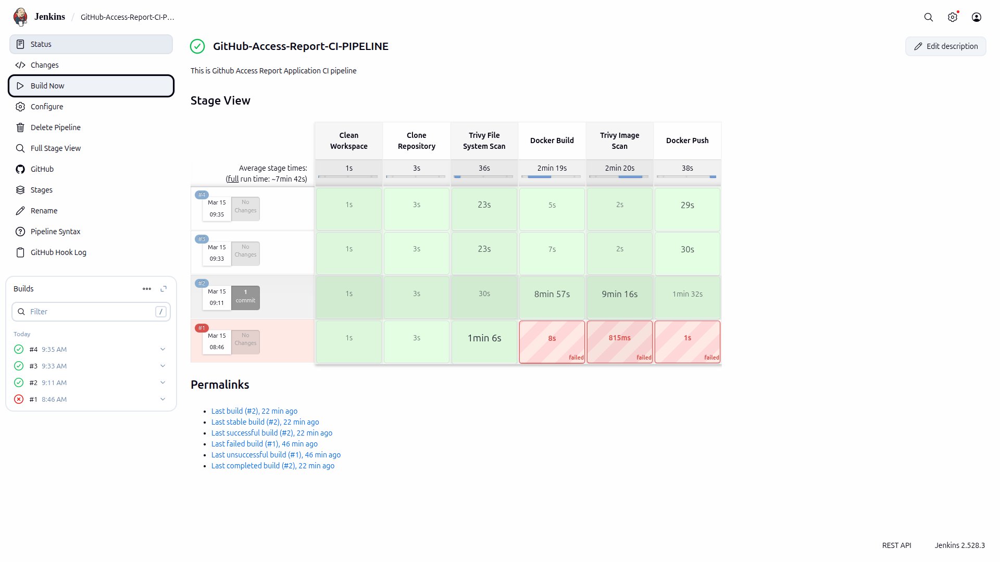

# GitHub Organization Repository Access Report Service

## Overview

Organizations often need visibility into **which users have access to which repositories** within a GitHub organization. This project provides a backend service that connects to the GitHub API, retrieves repository and collaborator information, and generates a structured access report.

The service aggregates repository access data and exposes it through a REST API endpoint. This enables administrators or internal tools to quickly analyze repository access across an organization.

The application is built using **Spring Boot** and follows clean backend architecture principles to ensure maintainability, scalability, and reliability.

---

## Key Features

- Connects securely to the **GitHub REST API**
- Retrieves repositories belonging to a GitHub organization
- Determines which users have access to each repository
- Generates an aggregated **user → repositories access report**
- Exposes the report through a **REST API endpoint**
- Supports organizations with **100+ repositories and 1000+ users**

---

## Production-Ready Enhancements

Beyond the minimum requirements, this project includes several improvements typically used in real-world backend systems:

- **Pagination support** for GitHub APIs
- **Parallel API calls** to improve performance
- **Retry mechanism** for temporary API failures
- **Timeout configuration** for external API calls
- **Rate-limit awareness** when interacting with GitHub
- **API response caching** to reduce repeated GitHub calls
- **Global exception handling** – consistent API error responses
- **Swagger/OpenAPI documentation** – interactive API documentation
- **Jenkins Continuous Integration (CI) pipeline** – that automates the build, security scanning, and Docker image

---

### Swagger UI automatically documents APIs and allows testing APIs directly from browser.

This API endpoint fetches repository access information for a given GitHub organization. It aggregates repository collaborators and their permission levels, providing a structured access report grouped by user. The response also highlights repositories whose collaborator information could not be accessed due to GitHub permission limitations.
<p align="center">
  
</p>


---

## Jenkins Continuous Integration (CI) pipeline

<p align="center">
  
</p>

---

## CI Pipeline (Jenkins)

This project includes a Jenkins Continuous Integration (CI) pipeline that automates the build, security scanning, and Docker image publishing process whenever changes are pushed to the repository.

The pipeline ensures that the application is built, analyzed for vulnerabilities, and packaged into a Docker image in a fully automated manner.

Pipeline Stages

The Jenkins pipeline consists of the following stages:

Clean Workspace
Clears the Jenkins workspace to ensure a fresh build environment.

Clone Repository
Pulls the latest source code from the GitHub repository.

Trivy File System Scan
Performs a vulnerability scan on the project files using Trivy to detect potential security issues in dependencies and source code.

Docker Build
Builds the Docker image for the Spring Boot application using the multi-stage Dockerfile.

Trivy Image Scan
Scans the built Docker image for vulnerabilities to ensure the container is secure before deployment.

Docker Push
Pushes the built Docker image to Docker Hub, making it available for deployment.

---

## Architecture

This project follows a **layered architecture** to ensure clean separation of responsibilities and maintainable code.

The main layers are:

Controller → Service → Client → GitHub API

1. **Controller Layer**
    - Exposes REST API endpoints
    - Handles incoming HTTP requests
    - Delegates business logic to the service layer

2. **Service Layer**
    - Contains core business logic
    - Aggregates repository and collaborator data
    - Generates the final access report

3. **Client Layer**
    - Responsible for communicating with the GitHub API
    - Fetches repositories and repository collaborators

4. **Configuration Layer**
    - Manages application configuration such as GitHub API settings and RestTemplate configuration

5. **Exception Layer**
    - Handles application errors in a centralized way
    - Provides consistent error responses

6. **Utility Layer**
    - Contains reusable helper methods used across the application

7. **Model Layer**
    - Represents data structures used internally to map GitHub API responses.
8. **DTO Layer** 
    - Defines objects used for transferring data in API responses.
   
---

## Request Flow

The following flow illustrates how a request is processed in the system:

1. **Client Request**  
   A client sends a request to the API endpoint with a GitHub organization name.

2. **Controller Layer**  
   `GithubAccessController` receives the request and forwards it to the service layer.

3. **Service Layer**  
   `GithubAccessServiceImpl` processes the request and coordinates the data aggregation logic.

4. **GitHub API Client**  
   `GithubApiClient` communicates with the GitHub REST API to retrieve:
    - repositories of the organization
    - collaborators for each repository

5. **Data Aggregation**  
   The service aggregates the data into a mapping of:

   user → repositories they can access

6. **Response Generation**  
   The final structured access report is returned as a JSON response to the client.

---

## Project Structure

The project is organized into multiple packages to maintain a clean and modular structure.
````
com.omprakash.github_access_report
│
├── controller
│ └── GithubAccessController.java
│ Handles REST API endpoints.
│
├── service
│ ├── GithubAccessService.java
│ └── GithubAccessServiceImpl.java
│ Contains business logic for generating the access report.
│
├── client
│ └── GithubApiClient.java
│ Responsible for communicating with the GitHub REST API.
│
├── model
│ ├── RepositoryInfo.java
│ ├── UserInfo.java
│ └── AccessReport.java
│ Internal data models representing GitHub API responses.
│
├── dto
│ └── UserRepositoryAccessDTO.java
│ Data Transfer Object used for API responses.
│
├── config
│ ├── RestTemplateConfig.java
│ └── GithubConfig.java
│ Application configuration classes.
│
├── exception
│ ├── GithubApiException.java
│ ├── CustomErrorResponse.java
│ └── GlobalExceptionHandler.java
│ Handles application exceptions and error responses.
│
├── util
│ └── GithubApiUtils.java
│ Utility methods used across the application

````

---

## Prerequisites

Before running the project, ensure the following tools are installed on your system:

- **Java 21** – Required to run the Spring Boot application
- **Maven** – Used for dependency management and building the project
- **GitHub Personal Access Token** – Required to authenticate with the GitHub API

You can verify the installations using the following commands:

```bash
  java -version
  mvn -version
```

---

## Configuration

The application authenticates with the GitHub API using a **GitHub Personal Access Token (PAT)**.

The token must be configured in the application configuration file.

### Step 1: Create a GitHub Personal Access Token

1. Go to GitHub Settings.
2. Navigate to **Developer Settings → Personal Access Tokens → Tokens (classic)**.
3. Click **Generate new token**.
4. Provide a description for the token.
5. Grant the following permissions:

- `repo`
- `read:org`

6. Generate the token and copy it.

### Step 2: Configure the Token

Open the following file:
  
    `src/main/resources/application.properties`


Add the following configuration:

    `github.token=YOUR_GITHUB_PERSONAL_ACCESS_TOKEN
     github.base-url=https://api.github.com`


Replace `YOUR_GITHUB_PERSONAL_ACCESS_TOKEN` with the token generated from GitHub.

### Security Note

The GitHub token should **not be committed to public repositories**.  
For production environments, it is recommended to store the token using environment variables or a secure secret management system.

## How to Run the Project

Follow the steps below to run the application locally.

### 1. Clone the Repository

```bash
    git clone https://github.com/your-username/github-access-report.git

    cd github-access-report
```

### 2. Build the Project

- Use Maven to build the application.
```bash
    mvn clean install
```

### 3. Configure GitHub Authentication

- Ensure the following properties are configured in:

- src/main/resources/application.properties
```bash
   github.token=YOUR_GITHUB_PERSONAL_ACCESS_TOKEN 
   github.base-url=https://api.github.com
 ```

### 4. Run the Application

- Run the Spring Boot application using Maven:
```bash
  mvn spring-boot:run
```

- Alternatively, you can run the main class:

- GithubAccessReportApplication.java

### 5. Access the API Documentation

- Once the application starts, open the Swagger UI:

    `http://localhost:8080/swagger-ui/index.html`


- Swagger provides an interactive interface to test the API endpoints.


---

## API Endpoint

The application exposes a REST API endpoint that generates a repository access report for a GitHub organization.

### Endpoint

GET /v1/api/github/access-report

### Query Parameter

| Parameter | Type | Description |
|----------|------|-------------|
| org | String | Name of the GitHub organization |

### Example Request

```bash
  http://localhost:8080/v1/api/github/access-report?org=google
```

### Example Response
```aiignore
{
    "organization": "google",
    "accessReport": {
        "alice": ["repo1", "repo2"],
        "bob": ["repo3"]
    }
}
```

### Testing with Swagger

- The API can also be tested using Swagger UI.

```aiignore
   http://localhost:8080/swagger-ui/index.html
```

- Swagger provides an interactive interface to test the endpoint directly from the browser.

---

## Assumptions & Design Decisions

### Assumptions

- A valid **GitHub Personal Access Token (PAT)** is required to access the GitHub API.
- The token must have sufficient permissions such as `repo` and `read:org` to retrieve repository and collaborator information.
- The GitHub organization being queried must be accessible using the provided token.
- The GitHub API endpoints for repositories and collaborators are available and reachable during runtime.

### Design Decisions

- **Layered Architecture**  
  The project follows a layered architecture (`controller → service → client`) to separate responsibilities and maintain clean code organization.

- **Parallel Processing for Scalability**  
  Repository collaborator requests are processed using parallel streams to improve performance when dealing with organizations containing many repositories.

- **Pagination Handling**  
  GitHub API pagination is handled to ensure all repositories are retrieved, even when organizations have more than the default page size limit.

- **Retry Mechanism**  
  A retry mechanism is implemented using Spring Retry to handle temporary network failures or transient GitHub API issues.

- **Timeout Configuration**  
  Connection and read timeouts are configured for external API calls to prevent the application from hanging when GitHub API responses are delayed.

- **Caching Strategy**  
  Spring Cache is used to cache generated access reports to avoid repeated GitHub API calls for the same organization.  
  The caching mechanism is currently **in-memory** and intended for performance optimization in this implementation.

- **Global Exception Handling**  
  A centralized exception handler ensures consistent error responses and improves API reliability.

- **Configuration Management**  
  GitHub API configuration (token and base URL) is externalized in `application.properties` for better maintainability and security.

---

## Future Improvements

The following improvements could further enhance the system for large-scale or production environments:

- **Distributed Caching**
  Replace the current in-memory cache with a distributed cache such as Redis to support multiple application instances.

- **Asynchronous Processing**
  Use asynchronous task execution or message queues to process large organizations with many repositories more efficiently.

- **Advanced Rate Limit Handling**
  Implement smarter handling of GitHub rate limits using headers such as `X-RateLimit-Reset` to pause and resume requests automatically.

- **Authentication Enhancements**
  Support OAuth-based authentication or GitHub App authentication for more secure and flexible integrations.

- **Monitoring and Logging**
  Integrate monitoring tools such as Prometheus and Grafana for metrics and system observability.

- **Containerization**
  Provide Docker support to simplify deployment in cloud environments.

- **Automated Tests**
  Add unit and integration tests to ensure long-term maintainability and reliability.

---

## Technologies Used

The project is built using the following technologies and frameworks:

- **Java 21** – Core programming language used to implement the backend service.
- **Spring Boot** – Framework used to build the RESTful backend application.
- **Spring Web** – Provides REST API capabilities and HTTP request handling.
- **Spring Retry** – Implements retry mechanisms for transient GitHub API failures.
- **Spring Cache** – Provides in-memory caching to reduce repeated API calls.
- **RestTemplate** – Used to communicate with the GitHub REST API.
- **Lombok** – Reduces boilerplate code for models and DTOs.
- **Swagger / OpenAPI** – Provides interactive API documentation.
- **Maven** – Dependency management and project build tool.

---

## Author

**Om Prakash Sao**

- B.Tech Computer Science Engineer
- Exploring Backend Developer Opportunity (Java | Spring Boot)

**Contact**

- Email: saoomprakash2002@gmail.com  
- GitHub: https://github.com/omprakashsao 
- LinkedIn: https://www.linkedin.com/in/om-prakash-sao-6bb039240/

---


